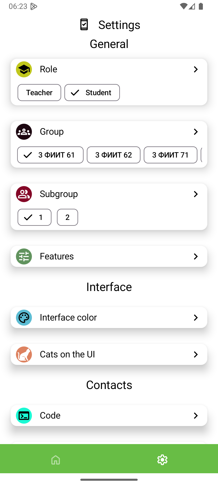

# Курсовая работа 6 семестр

## University Schedule

### Easily track your university classes with this simple scheduler app

 
 

### Navigation

* [Installation](#installation)
* [Features](#features)
* [Getting Started](#getting-started)

### Installation

Follow these simple steps:

1. Download the `.apk` file from [releases](https://github.com/vafeenLabs/Coursework_6-semester/releases) (or just click [this](https://github.com/vafeenLabs/Coursework_6-semester/releases/latest/download/app-release.apk)).
2. Approve the installation of the software on your device.
3. Have fun!

### Features

* Supported languages: **English**, **Russian**
* Supported themes: **Dark**, **Light**
* Works by creating a connection between the **App** and the server.
* Notifications 15 minutes before a class for a week in advance (enable it in **settings**).
* Notes about lessons (enable it in **settings**).
* Role: teacher or student.
* Choosing group for student role.
* Links to courses in Moodle (copying by long press and navigating by click).

#### Main screen

* Shows you all of the classes for each day.
* Indicates what class is going on right now and what will be the next one.
* If you’ve chosen a subgroup in **settings**, it will show you only this subgroup's classes; otherwise — all classes.
* You can also use the numerator/denominator logic if your class has a 2-week frequency.

    
    

    
    
    

#### Settings screen

##### General

* **Choose your role: student or teacher.**
* **Select group if you are a student.**
* **Select subgroup if you are a student.**

##### Interface

* Change interface color.
* Turn on/off cute cats.

##### Contacts

* App's code on **GitHub**.
* Report a bug via **Gmail**.

    

### Getting Started

#### Usage

How to link your schedule to our **App**:

1. Choose your role, group, and subgroup in the settings.
2. Ensure you have access to your schedule data.
3. Follow the instructions in the App's *settings* menu.

#### Note

**The table feature has been removed as data is now fetched directly from the server.**
